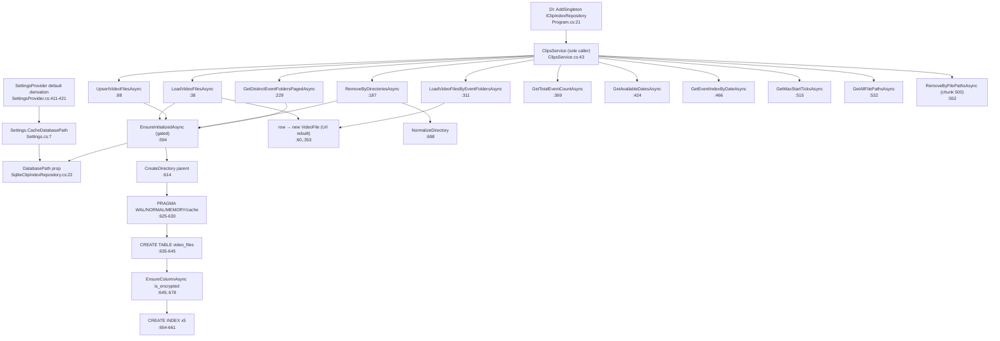

# F2 — Clip Index Storage (SQLite): `SqliteClipIndexRepository`

Base path: `TeslaCamPlayer/src/TeslaCamPlayer.BlazorHosted/`

## Public API + callers

All 12 members declared on `IClipIndexRepository` (`Server/Services/Interfaces/IClipIndexRepository.cs:7-33`). Singleton at `Server/Program.cs:21`. Sole consumer: `ClipsService` (`Server/Services/ClipsService.cs:43,49`).

| # | Method (SqliteClipIndexRepository.cs) | Kind | Callers (ClipsService.cs) |
|---|---|---|---|
| 1 | `LoadVideoFilesAsync` `:38` | read-all | `:68` |
| 2 | `ResetAsync` `:76` | `DELETE FROM video_files` | **none — dead interface method** |
| 3 | `UpsertVideoFilesAsync` `:88` | txn upsert | `:378`, `:561` |
| 4 | `RemoveByDirectoriesAsync` `:187` | txn delete-by-dir | `:87`, `:397`, `:863` |
| 5 | `GetDistinctEventFoldersPagedAsync` `:229` | paged/filtered | `:138` |
| 6 | `LoadVideoFilesByEventFoldersAsync` `:311` | read-by-folders | `:156` |
| 7 | `GetTotalEventCountAsync` `:369` | count | `:126` |
| 8 | `GetAvailableDatesAsync` `:424` | distinct dates | `:170` |
| 9 | `GetEventIndexByDateAsync` `:466` | index-of-date | `:176` |
| 10 | `GetMaxStartTicksAsync` `:515` | scalar max | `:341` |
| 11 | `GetAllFilePathsAsync` `:532` | path set (stale prune) | `:434` |
| 12 | `RemoveByFilePathsAsync` `:552` | chunked delete (500) | `:482` |

Private: `EnsureInitializedAsync :594`, `EnsureColumnAsync :678`, `NormalizeDirectory :698`; props `DatabasePath :22`, `ConnectionString :24`.

## Happy path

Every public method starts with `EnsureInitializedAsync` (`:594`): semaphore-gated one-time init keyed on DB path — create parent dir (`:611-615`), open (`Mode=ReadWriteCreate, Cache=Shared`), PRAGMAs WAL/NORMAL/MEMORY/cache (`:620-631`), `CREATE TABLE video_files` (`:635-645`, PK `file_path`), `is_encrypted` column migration (`:649`, `:678`), 5 indexes (`:652-662`). Each method then opens its own short-lived `SqliteConnection`; writes use explicit transactions (`:105/184`, `:209/226`, `:565/591`).

## Flowchart

## Duplication findings (feeds Phase 2)

1. **Connection-open boilerplate — 11 copies**: `await using var connection = new SqliteConnection(ConnectionString); await connection.OpenAsync(); await using var command = connection.CreateCommand();` at `:43-46, :80-83, :103-108, :207-212, :239-242, :322-325, :376-379, :428-431, :470-473, :519-522, :537-540, :563-574`.
2. **Dynamic WHERE-clause builder — 4 near-identical copies**: clipTypes IN(...) / fromTicks / toTicks block at `:244-276`, `:381-413`, `:475-489`, partial at `:433-445`; IN-param expansion idiom also at `:327`, `:577`.
3. **Row→`VideoFile` mapping — 2 identical copies**: `:52-70` vs `:345-363` (same SELECT list `:47` vs `:329`).
4. **`Convert.ToInt32(ExecuteScalarAsync())`**: `:420-421`, `:511-512`.
5. **`VideoFile.Url` recomputed, not persisted**: `$"/Api/Video/{Uri.EscapeDataString(path)}"` at `:63`, `:356` + `ClipsService.cs:1091`, `:1198` — 4 sites, 2 files; belongs on `VideoFile` or one factory.
6. **`directory_path` is derived-redundant** (always `Path.GetDirectoryName(file_path)`, `:172`).
7. **Dead code**: `ResetAsync :76` — zero callers. Magic literal `864000000000` (`TimeSpan.TicksPerDay`) at `:450`.
8. PRAGMA `cache_size`/`temp_store` applied only to init connection — no-ops for per-query connections.

## External dependencies

- Called by F1 (ClipsService) only. DB path from F7 (`Settings.CacheDatabasePath`, default derived at `SettingsProvider.cs:411-421` — default path duplicated in both files).

## Confidence

High (full class read, call sites grep-verified). Gap: ClipsService orchestration interiors out of scope (F1).
