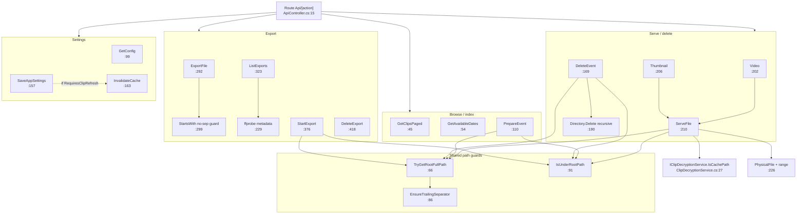

# F3 — Event/Clip API (`ApiController.cs`, 453 lines, 19 actions + 5 private helpers)

Base path: `TeslaCamPlayer/src/TeslaCamPlayer.BlazorHosted/`. Route base `[Route("Api/[action]")]` `:15`; `Video`/`Thumbnail` override with `{path}.mp4`/`{path}.png`.

## Action inventory

| Action | Verb | Line | Delegates to |
|---|---|---|---|
| GetClips | GET | :41 | ClipsService.GetClipsAsync |
| GetClipsPaged | GET | :45 | ClipsService.GetClipsPagedAsync |
| GetAvailableDates | GET | :54 | ClipsService |
| GetClipIndexByDate | GET | :58 | ClipsService |
| GetRefreshStatus | GET | :62 | RefreshProgressService.GetStatus |
| GetConfig | GET | :99 | SettingsProvider.Settings → AppConfig |
| TeslaStatus | GET | :106 | TeslaAuthService.ProbeAsync |
| PrepareEvent | POST | :110 | ClipsService.PrepareEncryptedEventAsync + Tesla exception mapping :138-145 |
| GetAppSettings | GET | :153 | SettingsProvider |
| SaveAppSettings | POST | :157 | SettingsProvider (+ InvalidateCache if RequiresClipRefresh :161-164) |
| DeleteEvent | DELETE | :169 | **inline** `Directory.Delete(recursive)` :190 |
| Video | GET | :202 | ServeFile(".mp4","video/mp4",range) |
| Thumbnail | GET | :206 | ServeFile(".png","image/png",no range) |
| ExportFile | GET | :292 | **inline** PhysicalFileResult :303 |
| ListExports | GET | :323 | ExportService.GetStatus + **inline** dir enumeration :331 + ffprobe metadata :229 |
| StartExport | POST | :376 | ExportService.StartExportAsync |
| ExportStatus | GET | :401 | ExportService.GetStatus |
| CancelExport | POST | :410 | ExportService.Cancel |
| DeleteExport | DELETE | :418 | **inline** `File.Delete` by jobId name-match :431-441 |

Helpers: `TryGetRootFullPath:66`, `EnsureTrailingSeparator:86`, `IsUnderRootPath:91`, `ServeFile:210`, `TryReadExportMetadata:229` (spawns ffprobe directly).

## Serve happy path

`Video:203`/`Thumbnail:207` → `ServeFile:210`: UrlDecode+ext `:212-213` → `GetFullPath :215` → `TryGetRootFullPath :216` → guard `:220` `IsUnderRootPath(path,root) || IClipDecryptionService.IsCachePath(path)` → `File.Exists :223` → `PhysicalFile(path, ct, range) :226`.

## Flowchart

## Duplication findings (feeds Phase 2)

1. **Four path-guard variants**: (1) `TryGetRootFullPath`+`IsUnderRootPath` `:66/:91` (correct, normalized); (2) `ClipDecryptionService.IsCachePath` (`ClipDecryptionService.cs:27`) — second copy of same technique + **second `EnsureTrailingSeparator`**; (3) `ExportFile:299` `StartsWith(exportsRoot)` **without trailing separator — traversal weakness** (`/data/exports-evil/` passes); (4) `DeleteExport:431` name-match enumeration. `ListExports:346` reuses weak no-sep StartsWith.
2. **Error-response copy-paste**: "Clips root path is not configured." ×4 (`:118,:177,:217,:391`); "Invalid path" ×5 (`:121,:180,:184,:299,:394`); jobId null-check ×3 (`:404,:413,:421`); `StatusCode(500, ex.Message)` ×2 (`:198,:450`) — **leaks raw exception text**. PrepareEvent alone uses 200-with-envelope convention.
3. **Two range mechanisms**: `PhysicalFile(...)` `:226` vs hand-built `PhysicalFileResult{EnableRangeProcessing=true}` `:303`; ExportFile doesn't reuse ServeFile.
4. **Controller bypasses services**: ListExports/ExportFile/DeleteExport touch export dir directly (ExportRootPath resolution duplicated with ExportService); `TryReadExportMetadata:229` spawns ffprobe directly despite `IFfProbeService` existing.
5. **Pre-existing bug flag**: `DeleteEvent` deletes indexed folder but never calls `InvalidateCache` → stale index until next refresh.

## External dependencies

Ctor `:25-39`: ISettingsProvider, IClipsService, IRefreshProgressService, IExportService, ITeslaAuthService, IClipDecryptionService.

## Confidence

High — controller read in full. Gap: whether ExportFile weakness is exploitable depends on ExportRootPath config (flagged, not confirmed exploit).
