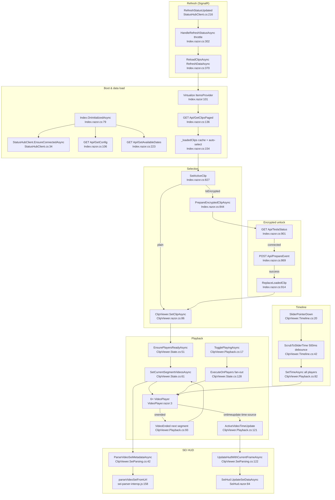

# F4 — Client player / viewer UI (Blazor WASM)

Base path: `TeslaCamPlayer/src/TeslaCamPlayer.BlazorHosted/`

## Happy path

**Boot/data**: `Program.cs:11-13` (HttpClient, MudServices, `StatusHubClient` singleton) → `Index.OnInitializedAsync :79` (scroll-debounce 100ms `:81`, refresh-throttle 200ms `:85`, SignalR handlers `:90-91`, `EnsureConnectedAsync :93`, `Api/GetConfig :106`, `Api/GetAppSettings :122`, `Api/GetAvailableDates :223`). Server-driven virtualization: `<Virtualize ItemsProvider=LoadClipsAsync>` (`Index.razor:101`) → `Api/GetClipsPaged?skip&take&types` (`Index.razor.cs:136`), caches into `_loadedClips[index] :154`, auto-selects item 0 `:171`. Deep-link `?eventPath=` in `OnAfterRenderAsync :238`.

**Selection**: click → `SetActiveClip :827` → imperative `_clipViewer.SetClipAsync :839` (not a `[Parameter]`) → `EnsurePlayersReadyAsync` (`State.cs:51`, poll 6 refs ≤5s) → `SetCurrentSegmentVideosAsync` (`State.cs:61`): per-tile `SetSrcIfChanged :80/:149`, front-cam SEI parse kick `:90`, wait for `onloadeddata` count or 5s `:100-118`.

**Sync model**: no drift correction — shared per-segment Src + `ExecuteOnPlayers` fan-out (`State.cs:128`) for play/pause/speed/seek; one front-first time-source (`TimeSourcePriority` `TileLayout.cs:70`, `GetActiveTimeSourcePlayer` `Playback.cs:145`) drives slider + HUD via `ActiveVideoTimeUpdate` (`Playback.cs:121`); segment rollover `VideoEnded` (`Playback.cs:93`).

**Timeline**: `TimelineSliderPointerDown` (`Timeline.cs:20`) → `ScrubToSliderTime :42` (500ms debounce via `TimelineValue` setter `State.cs:38`) → `SetTimeAsync` all players (`Playback.cs:82`); `JumpToEventMarker :80` (event−5s).

**Encrypted unlock**: lock badge (`Index.razor:115`) → `PrepareEncryptedClipAsync :844` → `Api/TeslaStatus :901` → POST `Api/PrepareEvent :869` (manual `JsonConvert` `:872`) → `ReplaceLoadedClip :914` → `SetClipAsync`.

## Flowchart

## HTTP endpoints hit (call sites)

`Api/GetConfig :106`, `Api/GetAppSettings :122`, `Api/GetClipsPaged :136/:142`, `Api/GetAvailableDates :223/:229`, `Api/GetClips?refreshCache=true :288` (fire-and-forget), `Api/GetClipIndexByDate :783/:787`, `Api/PrepareEvent :869`, `Api/TeslaStatus :905`, `Api/DeleteEvent :669`, `Api/StartExport :550` (**System.Text.Json**); dialogs: `Api/TeslaStatus` (`SettingsDialog.razor:175`), `Api/SaveAppSettings` (`:268`), `Api/ListExports` (`ExportHistory.razor:92`, `ExportHistoryDialog.razor:147`, STJ), `Api/CancelExport` ×3, `Api/DeleteExport` ×2. Implicit: thumbnails, video src, SEI `fetch(videoUrl)` (`sei-parser-interop.js:165`).

## Duplication / dead-code findings (feeds Phase 2)

1. **`EventFilterValues.IsInFilter` (`Client/Models/EventFilterValues.cs:21-45`) is dead** — never called. Real filtering collapses 7 UI toggles to 3 coarse ClipTypes (`GetSelectedClipTypes :187`); fine-grained toggles silently don't filter. One dead client copy + one lossy server mapping.
2. **Two JSON stacks**: Newtonsoft (`HttpClientNewtonsoftJsonHelper.cs:11`, 8 GETs + manual `JsonConvert :872`) vs System.Text.Json (`StartExport :550/:552`, export history). Drift risk if Shared models rely on Newtonsoft attributes.
3. **Active clip held twice**: `Index._activeClip :48` + `ClipViewer._clip` (`State.cs:15`), synced imperatively.
4. **Hand-rolled 6-field dirty check**: `CameraFilter` diffed field-by-field `razor.cs:63-81` because `CameraFilterValues` is a mutable class, not a record.
5. **`Index.razor.cs` = 1041 lines, ≥7 concerns** (paging/scroll, date-picker, selection/nav, unlock, SignalR refresh, export orchestration `:453-589`, dialogs). ClipViewer is already split into 8 concern partials — Index is the outlier.
6. Debug leftovers: `Console.WriteLine` at `Timeline.cs:32`, `State.cs:112/:117`.
7. No localStorage use anywhere (grep-verified).

## External dependencies

MudBlazor, Virtualize, SignalR client, Newtonsoft.Json + System.Text.Json, protobufjs 7.2.6 **CDN** (`index.html:28`), `DashcamMP4` global, `window.SeiHud` global, site.js FLIP/ESC helpers.

## Confidence

High — all listed files read in full. Sync-absence claim grep-verified. Server semantics out of scope.
