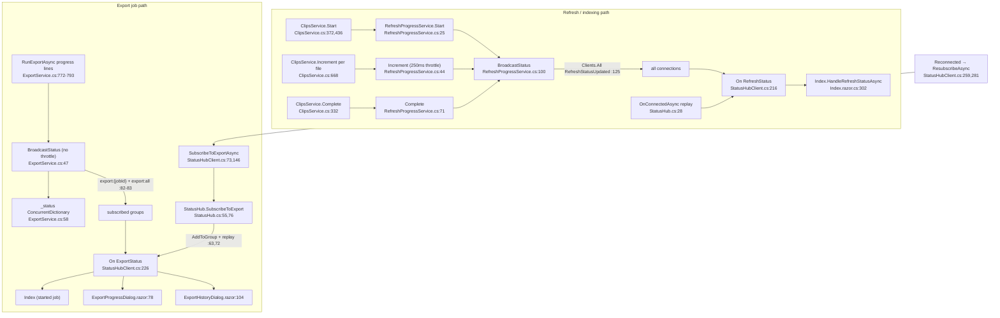

# F5 — Real-time Status (SignalR)

Base path: `TeslaCamPlayer/src/TeslaCamPlayer.BlazorHosted/`

## Hub + broadcast sites

`StatusHub` (`Server/Hubs/StatusHub.cs`): `OnConnectedAsync:19` (replays refresh status to caller `:28`), `OnDisconnectedAsync:33`, `SubscribeToExport:55` (group `export:{jobId}` `:63`, replay `:72`), `SubscribeToAllExports:76` (`export:all` `:78`), `UnsubscribeFromExport:84`, `UnsubscribeFromAllExports:100`. Mapped `Program.cs:95`.

Only two `IHubContext<StatusHub>` injections exist:
- `RefreshProgressService.cs:17/20` → `Clients.All.SendAsync("RefreshStatusUpdated", …)` at `:125`; `Start:25`, `Increment:44` (250 ms throttle `:13,:57`), `Complete:71`, `GetStatus:83`, clone `:91`, `BroadcastStatus:100`.
- `ExportService.cs:25/90` → private `BroadcastStatus:47` sends to `export:{jobId}` + `export:all` (`:82-83`), clone `CloneStatus:34`, state in `ConcurrentDictionary _status`. **No ExportProgressService exists** — export's broadcast concern is inlined in the 1000-line ExportService.

Client: single shared `HubConnection` in `StatusHubClient` (singleton, `Client/Program.cs:13`): `On<RefreshStatus>:216`, `On<ExportStatus>:226`, `RegisterRefreshHandler:39` / `RegisterExportHandler:56`, `EnsureConnectionAsync:194`, `WithAutomaticReconnect:213`, `Reconnected → ResubscribeAsync:259/281` with ref-counted subscription tables. Consumers: `Index.razor.cs:90-91,302`, `ExportProgressDialog.razor:58-123`, `ExportHistoryDialog.razor:74-259`.

## Flowchart

## Parallel-implementation analysis (feeds Phase 2)

Refresh and export are two implementations of the same "cache latest status, replay on subscribe, clone, fire-and-forget broadcast" concern:

| Concern | RefreshProgressService | ExportService.BroadcastStatus |
|---|---|---|
| Extraction | Dedicated service + interface | Inlined private method, no interface |
| Throttling | 250 ms gate | **none** — every ffmpeg line broadcasts |
| Fan-out | `Clients.All` | groups `export:{jobId}` + `export:all` |
| Cardinality | single global status | dict keyed by jobId |
| Concurrency | `lock` + clone method | ConcurrentDictionary + static clone |
| Error pattern | `ContinueWith(OnlyOnFaulted)` `:126` | identical `:85` |

Client-side reconnect/resubscribe is **centralized and well-designed** (one HubConnection, ref-counted subscriptions) — not duplicated. Minor type-driven duplication: RegisterRefreshHandler/RegisterExportHandler + notify loops are parallel per DTO (acceptable; generic channel would be over-engineering).

## External dependencies

SignalR server+client packages, Serilog, ffmpeg `-progress pipe:1` as timing source (`ExportService.cs:752,772`), MudBlazor dialogs, NavigationManager (`StatusHubClient.cs:212`).

## Confidence

High; exhaustive IHubContext grep. Gaps: UI-render tails of handlers not line-verified.
