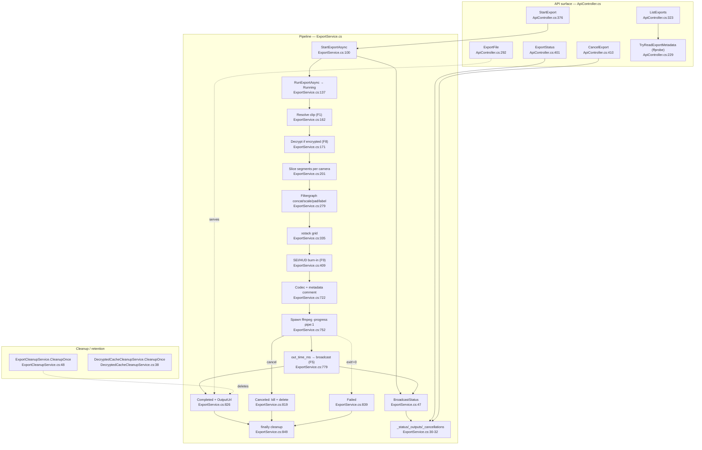

# F6 — Export / Clip Rendering

Base path: `TeslaCamPlayer/src/TeslaCamPlayer.BlazorHosted/`

## Happy path

`Index.razor.cs:533` builds `ExportRequest` → `POST Api/StartExport` `:550` → `ApiController.StartExport:376` (validation + `IsUnderRootPath` `:389-394`) → `ExportService.StartExportAsync:100` (jobId, Pending broadcast `:103`, CTS registered `:111`, `Task.Run(RunExportAsync)` `:113`, fire-and-forget) → `RunExportAsync:137`:

1. Running `:143-156`; interval validation `:159`; clip resolution `_clipsService.GetClipsAsync(false)` `:162` (F1).
2. Decrypt-if-encrypted `:171` → `PrepareEncryptedEventAsync` `:173` (F8).
3. Per-camera segment slicing `:201-225` (`CameraToFile :219/:1023`).
4. ffmpeg args: `ExportRootPath` `:228`; inputs `-accurate_seek/-ss/-t/-i` `:251-257`; grid math `:266-275`; concat/scale/pad `:292-317`; camera labels `:320-329`; xstack `:335-349` (single-cam copy `:352`); CFR `:356-359`; location drawtext `:375-388`; timestamp drawtext `:391-401`.
5. SEI/HUD burn-in (F9), gate `willUsePythonHud :369`: `GetFrameTimelineAsync :437`, `ExtractSeiMessages :446`, frame mapping `:468-511`, `ResampleSeiMessages :602/:911`, `RenderHudFramesToDirectoryAsync` → `{jobId}_hud_frames` `:654/:672`, overlay input `:687-690`, `overlay=0:0:shortest=1` `:701-707`.
6. Codec `AddCodecArgs :723/:959`; embedded `-metadata comment=…Location=…;EventPath=…` `:726-744`; output `{jobId}.{ext}` `:232/:748`.
7. Spawn ffmpeg `:752-763`, parse `out_time_ms=` `:779-795` → `BroadcastStatus` `:787` (F5, unthrottled); cancel via `proc.Kill(true)` `:811-813`.
8. Complete `:826-831` (`BuildDownloadUrl :829/:997`, `_outputs[jobId]` `:830`); cancel branch `:819-824`; fail branch `:839-842`; `finally :849-872` (CTS dispose, HUD dir delete, dead SRT branch `:854`).

History: no JSON — `ListExports:323` enumerates dir, fabricates Completed status `:337`, reads mp4 comment atom via ffprobe `TryReadExportMetadata:229` (`Location=`/`EventPath=` `:266-281`). Download served static `/exports/…` or `Api/ExportFile?path=` `:1004` → `ExportFile:292`. Retention: `ExportCleanupService.CleanupOnce:48` (age > retentionHours).

## Flowchart

## Duplication findings (feeds Phase 2)

1. **ffmpeg arg-pair idiom repeated ~15×** (`:251-257,:687-690,:717,:730,:742,:744,:966-974`) — no `AddArg` helper.
2. **ExportRootPath re-resolution ×5**: `ExportService.cs:228`, `:1003`; `ApiController.cs:298`, `:346`, `:426`.
3. **Download-URL logic duplicated**: `ExportService.BuildDownloadUrl:1004-1010` ≡ `ApiController.ListExports:345-353`.
4. **Status-construct + broadcast boilerplate ×7**: `:103,:146,:150,:787,:821,:831,:842`.
5. **Cleanup-service skeleton duplicated**: `ExportCleanupService.ExecuteAsync:31-46` ≡ `DecryptedCacheCleanupService.ExecuteAsync:21-36` (while/try/CleanupOnce/Delay); dir-guard + enumerate + per-file try-delete-log shape same; only policy differs (age `CreationTimeUtc :65-70` vs LRU-size `LastAccessTimeUtc :54-80` — intentional divergence, keep predicate pluggable).
6. **Dead code**: `ExportMetadata.cs` (constants referenced nowhere, casing doesn't even match actual tags); `EscapePath:887`; `QualityToQscale:989`; `srtPath :139` never assigned but drives cleanup branch `:854`.
7. **Progress-state divergence vs refresh**: in-memory dict + unthrottled groups vs locked single object + 250 ms throttle + Clients.All (see F5).

## Pre-existing bug flags (do NOT fix inline)

- On ffmpeg failure, partial `{jobId}.{ext}` is left on disk (deleted only on cancel `:822`) — `ListExports` can surface a corrupt export as Completed.

## External dependencies

F1 (`GetClipsAsync :162`), F8 (`PrepareEncryptedEventAsync :173`), F9 (`:437,:446,:672`), F5 (groups `:78-83`), F7 (ExportRootPath/RetentionHours/SpeedUnit `:228,:655`).

## Confidence

High — ExportService.cs read in full. Gaps: F9 internals treated as black box; client Export*.razor skimmed.
