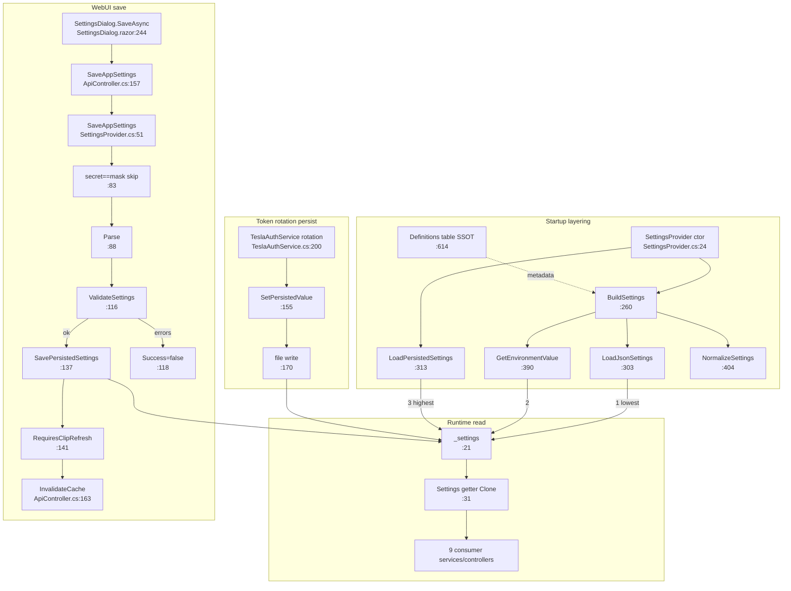

# F7 — Settings / Configuration Management

Base path: `TeslaCamPlayer/src/TeslaCamPlayer.BlazorHosted/`. Core: `Server/Providers/SettingsProvider.cs` (861 lines, singleton `Program.cs:19`).

## Layering (startup, ctor `:24`)

`GetSettingsFilePath :345` (`/config/teslacamplayer.settings.json` or BaseDir) → `LoadPersistedSettings :313` → `BuildSettings :260` layers **appsettings.json** (`LoadJsonSettings :303`; env vars NOT bound here) **< env vars** (per-definition `EnvVarNames`, `GetEnvironmentValue :390`, dual alias e.g. `ClipsRootPath`/`CLIPS_ROOT_PATH` `:622`; unlisted env vars ignored) **< WebUI overrides** (persisted Values `:284`). `NormalizeSettings :404` after each layer.

## Runtime read

No IOptions. Every consumer injects the singleton and reads `Settings` getter `:31-40` = `Clone(_settings)` under `_gate` → fresh deep copy, saves immediately visible. Consumers: ApiController, ClipsService, ExportService, ExportCleanupService, SqliteClipIndexRepository, SeiHudFilterBuilder, ClipDecryptionService, DecryptedCacheCleanupService, TeslaAuthService.

## WebUI save

`ApiController.SaveAppSettings:157` → `SaveAppSettings :51`: seed overrides, drop ResetKeys `:64`; skip unknown keys `:76`; **secret == mask `••••••••` → skip (keeps stored secret) `:83`**; `definition.Parse :88`; minimal-override rule `:98`; cross-field batch check `:108-113`; `ValidateSettings(createDirectories:true) :116` (write-probe `EnsureWritableDirectory :541`, tmp file `:558-560`); errors → nothing persisted `:118`; success → `SavePersistedSettings :137` (File.WriteAllText `:342`) + in-memory swap `:138-139`; `RequiresClipRefresh :141` (only ClipsRootPath `:627` + CacheDatabasePath `:638`) → controller invalidates clip cache `:163`.

## Programmatic persist

`SetPersistedValue :155` — exactly one caller: `TeslaAuthService.RefreshLockedAsync :200` (rotated refresh token). No validation pass; failure swallowed (token stays in memory).

## Flowchart

## Definitions table + duplication analysis (feeds Phase 2)

`CreateDefinitions :614` is the SSOT (key, label, env aliases, getter/setter, parser, isSecret, causesClipRefresh). DTO (`AppSettingItem`) and `SettingsDialog.razor` render **generically** — no per-setting duplication there. To add one setting: **3 mandatory edits** — `Settings.cs` property, `CreateDefinitions` entry, **`Clone(Settings) :564-582`** (+1 for grouping `Groups :137`).

**The footgun: `Clone :564` is a hand-maintained mirror of `Settings.cs`, used on every read.** Forget it → value silently stripped on every read, never persists. Highest-risk duplication in F7 (silent failure, no compile error).

Read consistency: everyone reads the live singleton; ctor-time captures in ExportCleanupService (`:20`, logging only) and TeslaAuthService (`:43`, self-healing re-read `:65-78`) are benign.

## Confidence

High — full read of provider, model, DTOs, dialog, all call sites.
