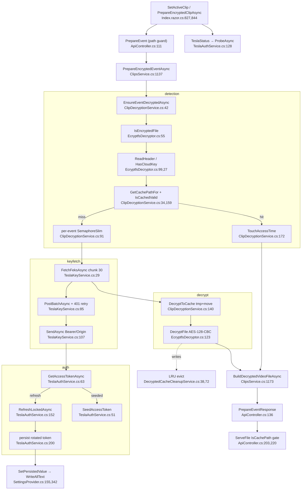

# F8 — Encrypted-clip decryption + Tesla auth

Base path: `TeslaCamPlayer/src/TeslaCamPlayer.BlazorHosted/`

## Happy path

1. Client `Index.razor.cs:827` `SetActiveClip` → `PrepareEncryptedClipAsync:844` → `GetTeslaStatusAsync:901` (GET `Api/TeslaStatus`) → POST `Api/PrepareEvent:869`.
2. `ApiController.TeslaStatus:107` → `TeslaAuthService.ProbeAsync:128` (never throws).
3. `ApiController.PrepareEvent:111` → path guard `:120` → `ClipsService.PrepareEncryptedEventAsync:1139` → `ClipDecryptionService.EnsureEventDecryptedAsync:42`.
4. Detection `:52-81`: enumerate `*.mp4` → `EcryptfsDecryptor.IsEncryptedFile:54` → `ReadHeader:60` → `HasCloudKey:68` → `GetCachePathFor:71` → `IsCachedValid:72` (hit → `TouchAccessTime:74`).
5. Coalesce per-eventDir `SemaphoreSlim` `:91-101`.
6. FEK fetch: `TeslaKeyService.FetchFeksAsync:29` (chunk ≤30 `:18`) → `BuildPayload:71` → `PostBatchAsync:85` (401 → one forced-refresh retry `:92`) → `SendAsync:107` (Bearer via `TeslaAuthService.GetAccessTokenAsync:63`).
7. Auth branches: **refresh rotation** `RefreshLockedAsync:152` (POST token endpoint, persist rotated token `:200` via `SetPersistedValue`, `InspectClaims:212`) or **seeded access token** `SeedAccessToken:51` (valid until `_expiresAt`, then `TeslaRefreshFailedException :96`).
8. Decrypt `:109-128`: `DecryptToCache:140` → tmp `+.tmp-{guid}` → `EcryptfsDecryptor.DecryptFile:149` (MD5(fek) root IV, per-page `DerivePageIv:108`, AES-128-CBC `PaddingMode.None`, truncate to PlaintextSize) → atomic `File.Move :150`.
9. Rebuild `ClipsService:1142-1170`: `DecryptedBySource` lookup, else re-`IsEncryptedFile:1151`; `BuildDecryptedVideoFileAsync:1173` ffprobes decrypted path, `Url=/Api/Video/{cachePath}`.
10. Serving: `Video:203` → `ServeFile:210` → `IsUnderRootPath || IsCachePath :220` → `PhysicalFile:226`.

Eviction: `DecryptedCacheCleanupService.CleanupOnce:38` — LRU by `LastAccessTimeUtc`, evict until under capBytes `:54-68`.

## Flowchart

## Error branches

No token → `TeslaNotConnectedException :68` → `NotConnected`; refresh rejected → `TeslaRefreshFailedException :183`; seeded expired `:96`; batch 401-after-retry `:100`; per-file FEK denied → `FekError` (PartialErrors, file skipped `ClipsService:1154`); header parse fail → warn+skip `:62`; no playable output → null `:1161` → `DecryptFailed`.

## Duplication findings (feeds Phase 2)

1. **Cleanup-service scaffolding duplicated** with `ExportCleanupService`: `ExecuteAsync` loop `:21-36` ≡ `:31-46`, settings/dir guard, per-file try-delete-log. Policies legitimately differ (LRU-size vs age) — keep predicate pluggable.
2. **Cache-path mirroring NOT duplicated** — single source `GetCachePathFor:34` / `IsCachePath:27`. Clean. (But `IsCachePath` contains the second `EnsureTrailingSeparator` copy — see F3.)
3. **Redundant re-detection**: per PrepareEvent each file header-read twice (`ClipDecryptionService:54` then `ClipsService:1151`); ClipsService could infer from `DecryptedBySource` absence. Cosmetic I/O.
4. `IsEncryptedFile` legit call sites: indexing `ClipsService:1066`, decrypt orchestrator `:54` — distinct purposes, fine.

## External dependencies

F7 (tokens, `SetPersistedValue`, DecryptedCachePath default `SettingsProvider:428`), `"tesla"` HttpClient (`Program.cs:29`), F1/F3 serving, hosted services registered `Program.cs:26,38`.

## Confidence

High — all Decryption/ files read in full. Gap: export's use of decrypted transient clip traced only to `ExportService.cs:171`.
