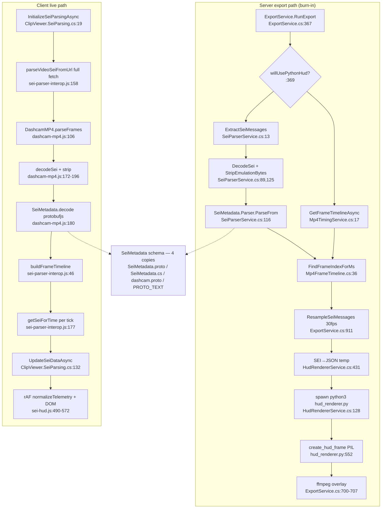

# F9 — SEI Telemetry / HUD Rendering (server C# + Python ⇄ client JS)

Base path: `TeslaCamPlayer/src/TeslaCamPlayer.BlazorHosted/`

## Server export path

Gate `willUsePythonHud = (wantsSeiHud || wantsLocationOverlay) && hasFrontCamera` (`ExportService.cs:369`). Per front segment: `Mp4TimingService.GetFrameTimelineAsync :437` (moov→trak→mdia→mdhd/stbl→stts walk `Mp4TimingService.cs:42-135`) + `SeiParserService.ExtractSeiMessages :446` (`FindMdatBox :148`, NAL length loop `:44-77`, SEI when `nalType==6 && payloadType==5` `:63`, Tesla `0x42…0x69` marker skip `DecodeSei:89`, `StripEmulationBytes:125`, `SeiMetadata.Parser.ParseFrom :116`). Align via `Mp4FrameTimeline.FindFrameIndexForMs :36`. `ResampleSeiMessages` to 30 fps (`ExportService.cs:911-957`). `HudRendererService.RenderHudFramesToDirectoryAsync :32` → SEI→JSON temp (`SerializeSeiMessages:431`) → spawn `python3 hud_renderer.py` (`:128`, args `BuildPythonArgumentsForDirectory:333`) → PIL `create_hud_frame` (`hud_renderer.py:552`) → PNG seq → ffmpeg `overlay=0:0:shortest=1` (`ExportService.cs:700-707`). Alternate SRT path: `SeiHudFilterBuilder.GenerateSeiSubtitleFile :20` (no confirmed caller). Dead-ish: `RenderHudFramesToPipeAsync :180` (no caller found).

## Client live path

`ClipViewer.SeiParsing.cs:19` → import `sei-parser-interop.js` `:28` → `initializeProtobuf :32` → `parseVideoSeiFromUrl :88` → **full MP4 re-fetch** (`sei-parser-interop.js:158-170`, no Range; clip downloaded twice) → `new DashcamMP4(buffer)` (`dashcam-mp4.js:106`): `findBox/getConfig :50-99` (same stts math as C# `:85-91` ⇄ `Mp4TimingService.cs:123-135`), NAL loop `:114-167`, `decodeSei :172-196` (same magic bytes + emulation strip), protobufjs decode `:180` → `buildFrameTimeline` (`sei-parser-interop.js:46`), `findFrameIndexForMs :69-100` (C# XML doc says "Matches web UI logic") → per tick `getSeiForTime :177` → `UpdateSeiDataAsync` (`ClipViewer.SeiParsing.cs:132-137`) → `updateTelemetry` (`sei-hud-interop.js:16`) → rAF loop `normalizeTelemetry` + DOM (`sei-hud.js:490-572`).

## Flowchart

## Duplication evidence (the core Phase-2 input)

**(a) NAL/SEI bitstream parser — line-by-line hand port, 2 copies:** mdat scan (`SeiParserService.cs:148-178` ⇄ `dashcam-mp4.js:40-43`), NAL loop (`:44-77` ⇄ `:152-167`), SEI select (`:63` ⇄ `:162`), Tesla marker skip (`:98-107` ⇄ `:175-177`), payload bounds (`:112-113` ⇄ `:180`), emulation strip (`:125-146` ⇄ `:187-196`).

**(b) Protobuf schema — 4 independently maintained copies that can drift:** `Server/Models/SeiMetadata.proto`, checked-in generated `SeiMetadata.cs` (**no `<Protobuf>` build item — regenerated by hand**), `Client/wwwroot/js/dashcam/dashcam.proto` (runtime fetch `dashcam-mp4.js:234`), inline `PROTO_TEXT` (`sei-parser-interop.js:7-44`). Byte-identical today; nothing tests them against each other.

**(c) MP4 box/timing parsing — 4 parsers:** `Mp4TimingService.cs:36-216`; `dashcam-mp4.js:50-99` (same walk + stts math); `Mp4DurationReader.cs:20-300` (mvhd-only tail read); `SeiParserService.FindMdatBox:148`. `FindBox` (`Mp4TimingService.cs:170`) ≡ `findBox` (`dashcam-mp4.js:17`) incl. identical 64-bit-size bail. Frame-index binary search duplicated: `Mp4FrameTimeline.cs:36-72` ⇄ `sei-parser-interop.js:69-100`.

**(d) HUD format/normalization — 3 copies (py/js/C#):**
| Concern | hud_renderer.py | sei-hud.js | third copy |
|---|---|---|---|
| speed conv 2.23694/1.60934 | `:586-588` | `:72,108-109` | `SeiHudFilterBuilder.cs:50-52` |
| throttle 0-1 heuristic | `:593` **<=1.5** | `:76` **<=1.2** | `HudRendererService.cs:446` <=1.2 — **LIVE DRIFT, python outlier** |
| gear map | `normalize_gear:162` | `GEAR_BY_INDEX:17` | `SeiHudFilterBuilder.cs:91` |
| autopilot map | `normalize_autopilot:192` | `:16` | `SeiHudFilterBuilder.cs:103` |
| heading normalize | raw | `:97` | `HudRendererService.NormalizeHeading:476` matches JS |
| key aliasing camel/snake | `pick_number :585` | `pickNumber :72` | — mirrors 4-schema ambiguity |

## Side effects

python3 spawn per export (killed on cancel `:151`); temp `%TEMP%/hud-render-{guid}` (deleted `:167`); PNG seq in export dir; **client full MP4 double-download**; in-memory caches (`parsedCache`, `_seiCache`).

## Confidence

High. Gaps: `RenderHudFramesToPipeAsync` caller-absence needs grep confirm before removal; SRT builder caller unconfirmed; `SeiMetadata.cs` regeneration-in-CI unverified.
