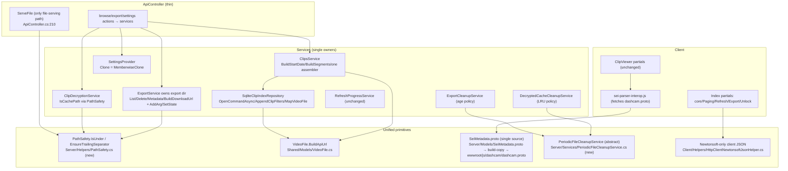

# Pathfinder Unified Proposal — docker-teslacamplayer

Date: 2026-07-18. Base path: `TeslaCamPlayer/src/TeslaCamPlayer.BlazorHosted/`.
Principle: deletion over abstraction; one path per concern; no new layers, no flags, no registries. Behavioral parity is the hard rule — pre-existing bugs in `02-duplication-report.md §D` are flagged, not fixed (one deliberate exception called out in U2).

## U1. Dead-code removal (no design — just deletion)

Delete everything in `02-duplication-report.md §C`. ~350 lines gone, zero behavior change. `SeiHudFilterBuilder` deletion also removes one of three HUD-formatter copies and one Settings consumer.

## U2. One path-safety helper

- **Component**: `Server/Helpers/PathSafety.cs` (static class, 2 methods): `EnsureTrailingSeparator(string)`, `IsUnder(string root, string fullPath)` (GetFullPath + separator-normalized Equals/StartsWith — the existing `ApiController.IsUnderRootPath:91` algorithm verbatim).
- **Call sites become**:
  - `ApiController.EnsureTrailingSeparator:86` + `IsUnderRootPath:91` → deleted, callers use `PathSafety`
  - `ClipDecryptionService.EnsureTrailingSeparator:196` → deleted; `IsCachePath:27` calls `PathSafety.IsUnder(cacheRoot, path)`
  - `ApiController.ExportFile:299` + `ListExports:346` no-sep `StartsWith` → `PathSafety.IsUnder(exportsRoot, path)`
- **Capability loss**: none. **Deliberate behavior change (security fix)**: the `exports-evil` sibling-directory bypass at `:299` stops passing. Called out per the parity rule; preserving a traversal weakness for parity's sake serves nobody.

## U3. SQLite repository internal consolidation

- **Component**: private helpers inside `SqliteClipIndexRepository` (no new files, no interface change except deleting dead `ResetAsync`):
  - `OpenCommandAsync()` → replaces 11 connection-open blocks
  - `AppendClipFilters(SqliteCommand, clipTypes, from, to)` → replaces 4 WHERE-builders
  - `MapVideoFile(SqliteDataReader)` + one shared SELECT column list → replaces 2 mapping blocks
  - `TimeSpan.TicksPerDay` replaces `864000000000` (`:450`)
- `Url` rebuild (`:63,:356`) → call U4's single factory.
- **Capability loss**: none (pure mechanical extraction inside one class).

## U4. One `VideoFile` URL factory

- **Component**: `VideoFile.BuildApiUrl(string filePath)` static method on the Shared model (`Shared/Models/VideoFile.cs`) — the `$"/Api/Video/{Uri.EscapeDataString(path)}"` rule in exactly one place.
- **Call sites become**: `SqliteClipIndexRepository.cs:63,:356`, `ClipsService.cs:1091,:1198` → `VideoFile.BuildApiUrl(...)`. Property stays settable — wire format unchanged.
- **Capability loss**: none.

## U5. ClipsService parsing/grouping consolidation (in place)

- **Components** (private helpers inside `ClipsService`, plus one shared normalizer):
  - `BuildStartDate(Match)` → replaces verbatim blocks `:1056-1062` / `:1184-1190` (and aligns `ParseTimestampFromMatch:796` where group names allow)
  - `BuildSegments(...)` reused by `GetRecentClips:996-1001` (drop the inline copy)
  - `BuildClipFromEventVideos:217` becomes the single event-clip assembler; `ParseClip:1208` delegates to it
  - `SeedKnownFiles()` → replaces `:354-360` / `:416-422`
  - `PathSafety`-adjacent: keep ONE `NormalizeDirectory` (move to the repo's or a tiny shared internal helper; delete the twin `ClipsService.cs:972` / `SqliteClipIndexRepository.cs:698`)
- **Capability loss**: none. The 3 regexes stay (different inputs — full filename vs folder vs file timestamps); only the DateTime-construction duplication goes.

## U6. Export ownership — service owns the export dir, controller delegates

- **Single entry point**: `IExportService` grows the operations the controller currently hand-rolls: `ListExportsAsync()`, `GetExportFilePath(jobId/path)` validation, `DeleteExport(jobId)`, metadata read.
- **Call sites become**:
  - `ApiController.ListExports:323-374` → thin delegation (dir enumeration `:331`, ffprobe spawn `:229`, URL shaping `:345-353` move into ExportService; metadata read uses the existing ffprobe service infrastructure instead of a raw `Process`)
  - `ApiController.DeleteExport:418-452` → `_exportService.DeleteExport(jobId)`
  - `ApiController.ExportFile:292-309` → reuses `ServeFile:210` (one range-serving mechanism)
  - `BuildDownloadUrl` remains the only URL shaper (controller copy deleted)
- **Within ExportService**: `AddArg(name, value)` helper for the ~15 arg-pair repetitions; `SetState(jobId, state, …)` wrapper for the 7 status+broadcast sites. Refresh/export broadcast services stay separate (legitimate specialization).
- **Capability loss**: none; response shapes unchanged.

## U7. One periodic-cleanup skeleton

- **Component**: `Server/Services/PeriodicFileCleanupService` — abstract `BackgroundService` holding the while/try/CleanupOnce/Delay loop + dir-guard + per-file try-delete-log; abstract members: `Interval`, `GetTargetDirectory()`, `SelectFilesToDelete(dir)`.
- **Call sites become**: `ExportCleanupService` (age policy) and `DecryptedCacheCleanupService` (LRU-size policy) each shrink to their policy override. Policies untouched.
- **Capability loss**: none. This is the one new abstraction in the whole proposal, and it replaces two existing copies (net deletion).

## U8. Settings `Clone` de-footgun

- **Component**: `Settings.Clone()` implemented via `MemberwiseClone()` (all props are value types/strings — shallow copy is exact). Hand-maintained 18-line mirror (`SettingsProvider.cs:564-582`) deleted; adding a setting drops from 3 mandatory edits to 2.
- **Capability loss**: none.

## U9. Single-source protobuf schema

- **Component**: `Server/Models/SeiMetadata.proto` becomes the ONE schema. Build step (MSBuild copy task in Client csproj or gulp) copies it to `Client/wwwroot/js/dashcam/dashcam.proto`. Inline `PROTO_TEXT` (`sei-parser-interop.js:7-44`) deleted; the runtime `fetch('dashcam.proto')` path (already implemented, `dashcam-mp4.js:234`) becomes the only client loading path.
- **Call sites become**: `dashcam.proto` = generated artifact (gitignored or build-stamped); `SeiMetadata.cs` stays checked-in (regeneration wiring is out of scope — noted as follow-up).
- **Capability loss**: client HUD now depends on the .proto fetch succeeding (previously had inline fallback). Acceptable: same-origin static file served by the same server that serves the app; if the app loads, the file loads.

## U10. One client JSON stack

- **Component**: Newtonsoft everywhere in the Client (it already handles 8 of 11 call sites and Shared models). Add `PostAsNewtonsoftJsonAsync`/`GetFromNewtonsoftJsonAsync` coverage for the 3 System.Text.Json sites (`Index.razor.cs:550/:552`, `ExportHistory.razor:92`, `ExportHistoryDialog.razor:147`).
- **Capability loss**: none (server model binding is case-insensitive; wire format compatible — verified by the fact both stacks already talk to the same endpoints).

## U11. Decompose `Index.razor.cs` into concern partials

- **Component**: split the 1041-line partial into the same pattern ClipViewer already uses: `Index.razor.cs` (core/selection), `Index.Paging.cs`, `Index.Refresh.cs`, `Index.Export.cs`, `Index.Unlock.cs`. Pure mechanical move — no method bodies change.
- **Capability loss**: none.

## Rejected unifications (anti-pattern check)

- **Merging RefreshProgressService + export broadcast** → rejected: different fan-out, cardinality, throttling; a generic "ProgressBroadcaster<T>" would be a new abstraction serving two divergent behaviors.
- **Server-side SEI API to kill the JS parser** → rejected: architecture/perf change (client would poll server per tick), violates parity.
- **Registry/config for path guards** → rejected: a 2-method static class suffices.
- **Record-ifying CameraFilterValues to kill the dirty check** → deferred to follow-up bundle: touches component-parameter semantics; low value vs risk here.

## Combined unified flowchart (target state)

## Expected impact

- Net line delta: strongly negative (dead code ~350 lines + dedup extractions).
- New files: 2 (`PathSafety.cs`, `PeriodicFileCleanupService.cs`) + client partial splits (moves, not additions).
- Zero API contract changes; one deliberate security tightening (U2, called out).
