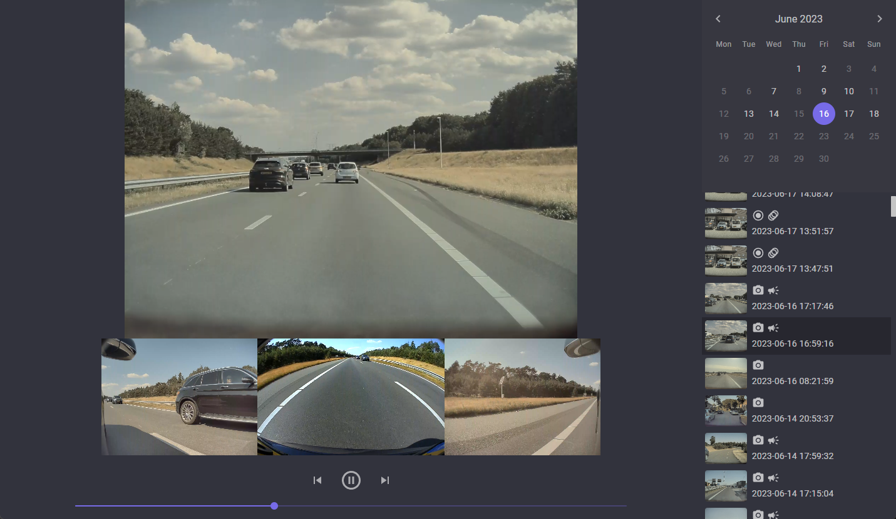

# TeslaCamPlayer

[](https://github.com/Rene-Sackers/TeslaCamPlayer/actions/workflows/release.yml)

GitHub: https://github.com/Rene-Sackers/TeslaCamPlayer

A Blazor WASM application for easily viewing locally stored Tesla sentry & dashcam videos.

Works great in combination with [TeslaUSB](https://github.com/marcone/teslausb).

First release, still needs some work, but functional and might be just what you needed :)



## Features

### Implemented

-   Infinite scrolling list of events (virtualized)
-   Icons to easily identify events (sentry/dashcam/honk/movement detected/manual save)
-   Calendar to easily go to a certain date
-   Auto scaling viewer
-   Supports MCU-1 (3 camera, missing back cam) and/or missing/corrupt angles
-   Event time marker on timeline
-   Filtering events
-   RecentClips viewing

### TODO/missing

-   Mobile viewport support
-   Progress bar for loading. Initial load checks the length of each video file, this may take a moment.
-   Map for event location
-   Exporting clips
-   General small issues

## Windows

The Windows build is a self-contained .exe, you do not need to install .NET, as it's compiled into the executable.

Download the latest version from [releases](https://github.com/Rene-Sackers/TeslaCamPlayer/releases/tag/v2023.7.23.1431) (teslacamplayer-win-x64-\*.zip) and extract the zip.

Modify `appsettings.json`, change the value for `ClipsRootPath`, set it to the path that contains your TeslaCam videos, and escape the \\ directory character with another \\ For example:

```json
{
	...
	"AllowedHosts": "*",
	"ClipsRootPath": "D:\\Some\\Folder\\TeslaCam"
}

```

Run `TeslaCamPlayer.BlazorHosted.Server.exe` and navigate to `http://localhost:5000` in your browser.

## Docker

```
docker run \
	-e ClipsRootPath=/TeslaCam \
	-v D:\\TeslaCam\\:/TeslaCam \
	-p 80:80 \
	teslacam
```

### Environment variables

| Variable | Example | Description |
| --- | --- | --- |
| ClipsRootPath | /TeslaCam | The path to the root of the clips mount in the container. This is set by default, you do not need to change it if you mount the volume to this path. |
| ElasticApm__Enabled | true | Toggle the backend Elastic APM agent. Set to `false` to disable all telemetry features quickly. |
| ElasticApm__ServerUrls<br/>ELASTIC_APM_SERVER_URL | https://apm.example.com | Comma-separated Elastic APM intake URLs that receive traces, metrics, and errors. |
| ElasticApm__SecretToken<br/>ELASTIC_APM_SECRET_TOKEN | secret-token | Optional shared secret/token when Elastic APM intake requires authentication. |
| ElasticApm__Environment<br/>ELASTIC_APM_ENVIRONMENT | production | Logical environment name applied to traces, metrics, and logs. |
| ElasticApm__MetricsPublishIntervalSeconds | 60 | Interval (seconds) between server-side custom metric snapshots for clip cache health. |
| ElasticApm__Rum__IsEnabled | true | Enables the browser Real User Monitoring agent and configuration endpoint. |
| ElasticApm__Rum__ServerUrl | https://apm.example.com | Overrides the RUM intake URL (falls back to `ServerUrls` when empty). |
| ElasticApm__Rum__ServiceName | teslacamplayer-web | Name reported by the browser agent. Use separate names per environment if desired. |
| ElasticApm__Rum__DistributedTracingOrigins__0 | https://api.example.com | Allows the browser agent to propagate trace context to additional origins (repeat with `__1`, `__2`, ... for more). |

### Volumes

| Volume    | Description                                                                                                                                          |
| --------- | ---------------------------------------------------------------------------------------------------------------------------------------------------- |
| /TeslaCam | Should contain the event folders with the camera files (eg. RecentClips, SavedClips, SentryClips) Mounts to the `ClipsRootPath` environment variable |

### Ports

| Port | Description                 |
| ---- | --------------------------- |
| 80   | The HTTP web interface port |

### Elastic observability

-   **Backend** – The server project now ships with the Elastic APM .NET agent (`Elastic.Apm.NetCoreAll`). Configure it through `appsettings.json` (`ElasticApm` section) or environment variables (`ElasticApm__*` or the standard `ELASTIC_APM_*` keys) to capture traces, errors, and clip-indexing spans. Structured Serilog output is enriched with `TraceId` and `TransactionId` so logs correlate with APM data automatically.
-   **Custom metrics** – A background publisher reports clip-cache health (clip count, events, refresh progress, latest timestamp) to Elastic APM every `ElasticApm__MetricsPublishIntervalSeconds` seconds and logs the same payload for dashboards.
-   **Frontend** – A browser RUM bootstrapper (`wwwroot/js/apm-init.js`) fetches `/api/observability/apm-rum-config` to initialise `@elastic/apm-rum`, enabling real-time user performance tracking, JS error capture, and distributed tracing for `HttpClient`/SignalR traffic. UI transitions emit custom spans so animation performance can be trended.
-   Disable RUM by setting `ElasticApm__Rum__IsEnabled=false` (the script short-circuits if the config endpoint returns `204 No Content`).

# Legal

pls no sue kthx

## Tesla

This software is in no way, shape or form affiliated with Tesla, Inc. (https://www.tesla.com/), or its products.
This software is not:

-   An official Tesla product
-   Licensed by Tesla
-   Built by or in conjunction with Tesla
-   Commisioned by Tesla

It does not directly impact Tesla products. It is an aftermarket piece of software that processes data produced by Tesla vehicles.

## FFmpeg

This software uses libraries from the FFmpeg project under the LGPLv2.1  
The Windows build of this software includes a copy of ffprobe.exe, compiled by: https://github.com/BtbN/FFmpeg-Builds/releases  
More info and sources for FFmpeg can be found on: https://ffmpeg.org/

[def]: releases
